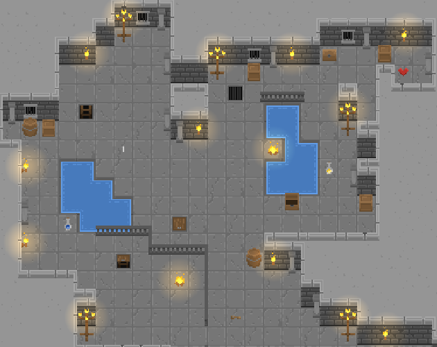

# Dragon Hood: Art Direction

## Purpose
Guide new and revised art toward a consistent camera, pixel size, and palette. Improve consistency over time; exact proportions are secondary to readability on a small screen.

## Scope
World art, characters, enemies, and environmental effects. The supplied dungeon image is the visual reference for pixel treatment, three-quarter perspective, and restrained surface detail, not a requirement to make every area a dungeon.

## World and mood
A bleak, dangerous post-apocalyptic fantasy world becomes cozy, bright, and welcoming under the player's influence. Steampunk machinery provides occasional accents, with richer concentrations in selected areas.

Unrestored places use weathered materials, subdued colour, and signs of neglect. Restored places look brighter and cleaner while retaining their material identity. Make the change readable at normal play scale. Additional repairs, greenery, or machinery changes depend on the site's design.

## Camera and scale
- All world assets use a consistent three-quarter top-down view: visible top surfaces and shorter front faces, with chunky, readable silhouettes.
- Raised surfaces reveal a front-facing wall or cliff below their top plane: a clear lip, shaded face, and grounded base. Roads and tilled plots can read as shallow depressions; selected zones and shrine footings can rise above their surroundings.
- Keep the square map axes aligned with the screen. This is not an isometric diamond grid.
- Everything except roads, buildings, and game characters lives on a 24px tile grid, scaled to the device for a crisp pixel look. Larger tiled objects can span multiple cells.
- Match apparent pixel size across assets. Use crisp scaling for raster art; avoid mixing tiny detailed pixels with enlarged coarse pixels in neighbouring objects.
- The 24px grid is the art target. Source sprites may be 16px or 24px; the current runtime display cell is 32px (`src/sprite_layout.js` and `src/app.js`). These are separate sizes; assess assets together at their final display scale.
- Characters and enemies have chunky proportions and move continuously, including between cells, to accommodate GPS movement. The art grid does not constrain movement.

## Colour, vectors, and light
- Use a shared, restrained palette across terrain, props, buildings, and actors. Coordinate material colours and shadow tones; reserve stronger colour and contrast for useful focal points and restoration.
- Vector art supports real-world road and building geometry. Smoother edges are acceptable; match the surrounding art's perspective, palette, and visual weight. A pixel-treated vector comparison is a future experiment.
- Preserve the strong existing lighting. Warm local lights help objects read against subdued surroundings; lighting supports the palette rather than hiding mismatched assets.

## Review at game scale
Check each addition beside existing art on a small screen: consistent camera, comparable pixel size, compatible colours, clear silhouette, and a legible unrestored/restored difference where applicable.
